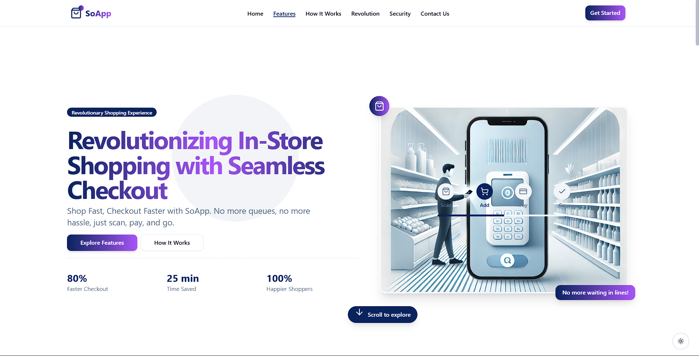

# SoApp - Revolutionizing In-Store Shopping with Seamless Checkout

## 🚀 About SoApp
SoApp is transforming the retail shopping experience by enabling customers to scan, pay, and go, eliminating the need for traditional checkout lines. By integrating advanced technologies, SoApp offers a seamless and efficient shopping journey for both customers and retailers.

For more details, visit [SoApp](https://soapp.kalehub.com/).

## Features

- **Seamless Checkout:** Customers can scan products directly while shopping using their smartphones, adding items to their virtual cart in real-time.
- **Real-Time Inventory Management:** Both store managers and customers receive instant alerts when a product is out of stock, ensuring transparency and aiding in inventory control.
- **In-Store Navigation:** Customers can search for items within the app and receive directions to the exact aisle in the store, enhancing the shopping experience.
- **Multiple Language Support:** The app offers multilingual support, including voice commands, to cater to a diverse customer base and assist the elderly or visually impaired.
- **Contactless Returns:** Customers can process returns directly through the app, saving time and reducing physical contact.
- **Enhanced Security:** Secure payments are facilitated using facial recognition and fingerprint authorization, ensuring customer data protection.

## How It Works

1. **Scan Products:** Customers use their smartphones to scan products while shopping, adding items to their virtual cart.
2. **View Product Details:** The app displays detailed information about each scanned product, allowing informed purchasing decisions.
3. **Track Items:** As items are added, customers can keep track of their purchases within the app.
4. **Complete Payment:** After shopping, customers can complete their payment securely via the app.
5. **Seamless Exit:** Upon payment, customers scan the receipt within the app at the store exit, allowing for a quick and hassle-free departure without waiting in checkout lines.

## The SoApp Revolution

SoApp addresses several challenges in the current retail environment:

- **Eliminates Long Queues:** By enabling self-checkout, SoApp significantly reduces or eliminates waiting times at checkout counters.
- **Reduces Operational Costs:** Minimizes the need for extensive manpower at checkout counters, allowing stores to allocate resources more efficiently.
- **Enhances Customer Service:** With streamlined operations, store staff can focus more on customer assistance and product availability.
- **Promotes Cashless Transactions:** Encourages secure, cashless payments, aligning with modern consumer preferences.

## Security Measures

SoApp incorporates multiple security features to ensure a safe shopping environment:

1. **Increased Surveillance:** Savings from operational efficiencies can be redirected to enhance in-store security through additional personnel and high-definition cameras.
2. **Product Monitoring Cameras:** Cameras on every shelf monitor product counts, preventing theft and providing real-time inventory insights.
3. **Weighing Systems for Bulk Purchases:** Integrated weighing machines ensure accurate tracking and pricing of bulk items like fruits and vegetables.
4. **AI & RFID/NFC for Theft Prevention:** Each item is tagged with RFID/NFC technology, ensuring that only paid items can leave the store. Unpaid items trigger alerts or lock the checkout process.
5. **Two-Factor Authentication:** Customers undergo a secure checkout process, including payment verification and receipt scanning at the exit, ensuring transaction authenticity.

## 🤝 Contributing
We welcome contributions! To contribute:
1. Fork the repository.
2. Create a new branch (`feature/your-feature`).
3. Commit your changes and push to GitHub.
4. Open a Pull Request.

## 📞 Contact
For inquiries or support, please reach out to us:
- **Email**: [soappnew@gmail.com](mailto:soappnew@gmail.com)
- **Phone**: +91 7990590921
- **Website**: [SoApp](https://soapp.kalehub.com/)

We look forward to hearing from you!

© 2024 SoApp. All rights reserved.
